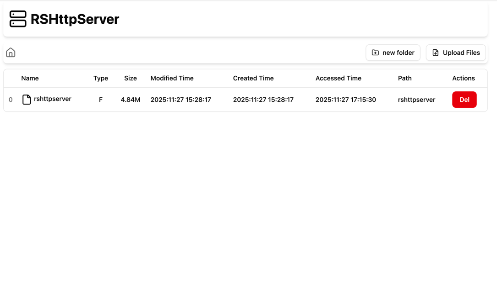

# RSHttpServer

## Requirements
rustc 1.91.1 (ed61e7d7e 2025-11-07)

## Screenshots


## Features
1. [x] Breadcrumb path quick change
1. [ ] Different file type different icon
1. [x] Upload support
1. [x] README.md preview
1. [x] Partial reload pages when directory change
1. [ ] Download count statistics
1. [ ] Offline download
1. [ ] Code file preview
1. [ ] Edit file support
1. [ ] Calculate md5sum and sha
1. [ ] Support sort by size or modified time
1. [x] Auto tag version
1. [x] Show folder size
1. [x] Create folder
1. [x] Skip delete confirm when alt pressed
2. [x] rust embed support

## Installation

```rust
$ cargo install --root . --path .
```

## Usage
```bash
$ rshttpserver --port 3000 --root data
```
Use command `rshttpserver --help` to see more usage.


## Developer Guide
1. Build single binary release
  ```sh
  $ cargo build --release
  ```